# Gestion de contenidos audiovisuales

Proyecto enfocado en la gestion de contenidos audiovisuales para usuarios registrados en la plataforma. Se integraron validaciones por medio de JWT y aplicacion de varias tecnologias como Java y Spring Boot para el correcto funcionamiento del proyecto.

## Tecnologias

-   **JWT**
-   **Java**
-   **MySQL**
-   **Hibernate**
-   **Spring Web**
-   **Spring Boot**
-   **Spring Security**
-   **Spring Data JPA**
-   **Swagger (OpenApi)**

## Despliegue

> [!NOTE]
> Para usar y ejecutar el proyecto de una mejor manera, realmente recomendamos haber instalado un IDE como IntelliJ.

-   Primero, clona el repositorio en tu máquina local.

    ```bash
    git clone https://github.com/jstorra/springboot-filtro.git
    ```

-   Abre el proyecto en tu IDE.

> [!IMPORTANT]
> Antes de ejecutar el proyecto debes haber creado la base de datos, ejecuta el siguiente código [DB](./src/main/resources/static/DB.sql) en tu DBMS MySQL.

-   Cambie [application.properties](./src/main/resources/application.properties) en caso de que haya modificado sus propiedades de MySQL como host, puerto, nombre de usuario o incluso la contraseña.

-   Ahora ejecuta el proyecto, si todo está bien no verás ningún error en la consola de salida.

> [!TIP]
> Disfruta del sistema.

# Base de Datos

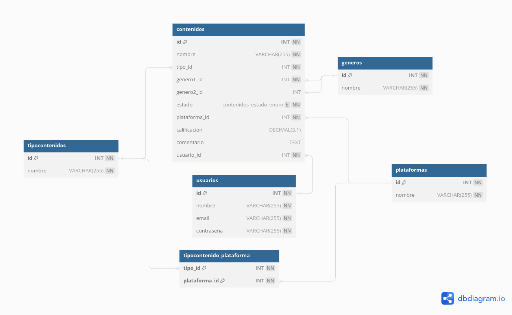

# Consumo de API (SWAGGER)

> [!IMPORTANT]
> Antes de realizar cualquier consulta en SWAGGER (OpenAPI) se debera introducir un token valido, sí ya tienes corriendo el sistema en el puerto 8080 dirigete a este [enlace](http://localhost:8080/doc/swagger-ui/index.html) y para testear las consultas deberas darle al boton **Try it out**.

<details>
  <summary><code>Usuario</code></summary>

El controlador de **Usuario** contiene 7 endpoints:

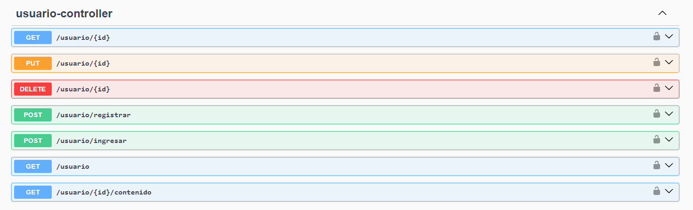

-   **Registrar:** Ingresaremos el nombre, correo y la contraseña.

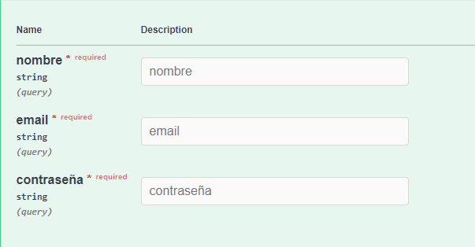

-   **Ingresar:** Ingresaremos el correo y la contraseña.

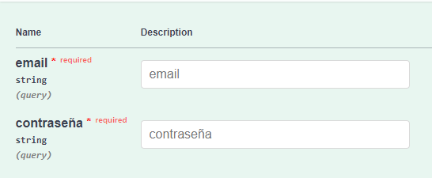

-   **Autenticación:** Sí las credenciales son correctas obtendremos el **Token**

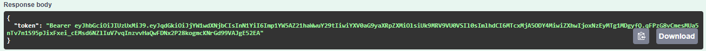

Lo copiamos y lo ponemos en la Autorizacion de SWAGGER para poder ejecutar las demas consultas:


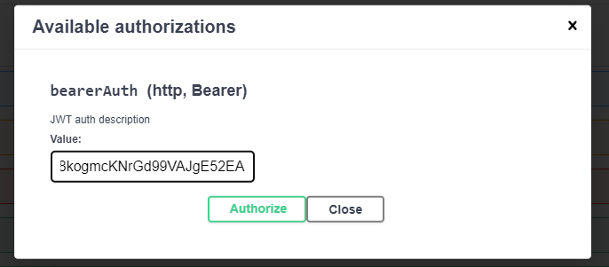

Damos click en Authorize y ya podremos usar SWAGGER libremente.

> Los demas endpoints funcionan de la misma manera, simplemente damos click en la consulta a realizar y se desplegara los parametros o valores que se requieren para su funcionamiento, [+info](#openapi-definition-usuario-controller).

</details>

<details>
  <summary><code>TipoContenido</code></summary>

El controlador de **TipoContenido** contiene 7 endpoints:

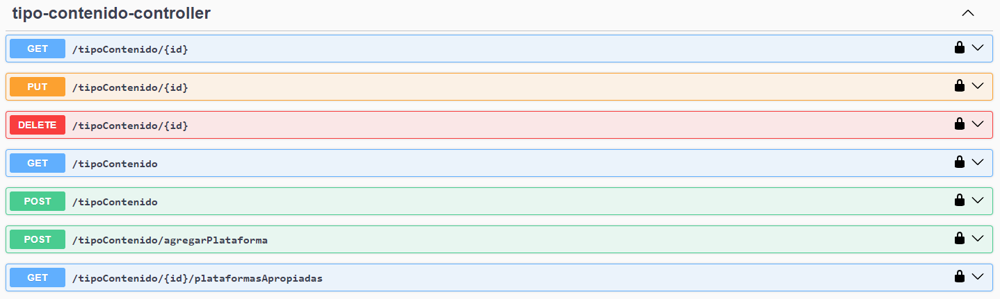

-   **Agregar plataforma:** Para asociar una plataforma al tipo de contenido se deberan ingresar los siguientes parametros por medio de un objeto JSON.

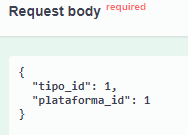

> Los demas endpoints funcionan de la misma manera, simplemente damos click en la consulta a realizar y se desplegara los parametros o valores que se requieren para su funcionamiento, [+info](#openapi-definition-tipo-contenido-controller).

</details>

<details>
  <summary><code>Plataforma</code></summary>

El controlador de **Plataforma** contiene 6 endpoints:

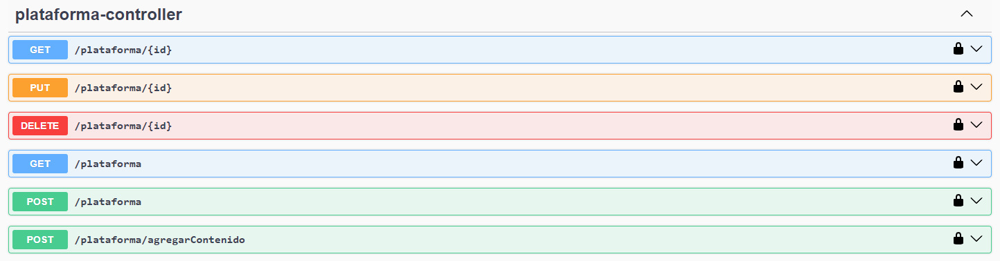

-   **Agregar tipo de contenido:** Para asociar un tipo de contenido a la plataforma se deberan ingresar los siguientes parametros por medio de un objeto JSON.


> Los demas endpoints funcionan de la misma manera, simplemente damos click en la consulta a realizar y se desplegara los parametros o valores que se requieren para su funcionamiento, [+info](#openapi-definition-plataforma-controller).

</details>

<details>
  <summary><code>Genero</code></summary>

El controlador de **Genero** contiene 5 endpoints:

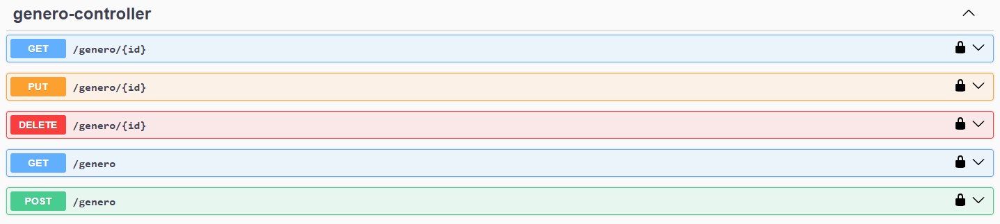

> Los endpoints funcionan de la misma manera, simplemente damos click en la consulta a realizar y se desplegara los parametros o valores que se requieren para su funcionamiento, [+info](#openapi-definition-genero-controller).

</details>

<details>
  <summary><code>Contenido</code></summary>

El controlador de **Contenido** contiene 5 endpoints:

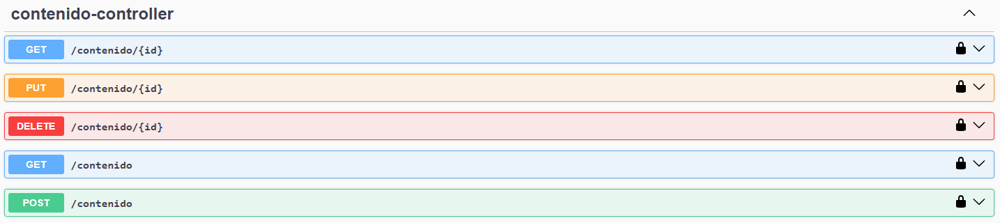

> Los endpoints funcionan de la misma manera, simplemente damos click en la consulta a realizar y se desplegara los parametros o valores que se requieren para su funcionamiento, [+info](#openapi-definition-contenido-controller).

</details>

# Referencias de API

<!-- Generator: Widdershins v4.0.1 -->

> Scroll down for code samples, example requests and responses. Select a language for code samples from the tabs above or the mobile navigation menu.

Base URLs:

-   <a href="http://localhost:8080">http://localhost:8080</a>

# Authentication

-   HTTP Authentication, scheme: bearer JWT auth description

<h1 id="openapi-definition-usuario-controller">usuario-controller</h1>

## obtenerUsuarios_1

<a id="opIdobtenerUsuarios_1"></a>

> Code samples

```java
URL obj = new URL("http://localhost:8080/usuario/{id}");
HttpURLConnection con = (HttpURLConnection) obj.openConnection();
con.setRequestMethod("GET");
int responseCode = con.getResponseCode();
BufferedReader in = new BufferedReader(
    new InputStreamReader(con.getInputStream()));
String inputLine;
StringBuffer response = new StringBuffer();
while ((inputLine = in.readLine()) != null) {
    response.append(inputLine);
}
in.close();
System.out.println(response.toString());

```

`GET /usuario/{id}`

<h3 id="obtenerusuarios_1-parameters">Parameters</h3>

| Name | In   | Type   | Required | Description |
| ---- | ---- | ------ | -------- | ----------- |
| id   | path | object | true     | none        |

> Example responses

> 200 Response

<h3 id="obtenerusuarios_1-responses">Responses</h3>

| Status | Meaning                                                          | Description | Schema |
| ------ | ---------------------------------------------------------------- | ----------- | ------ |
| 200    | [OK](https://tools.ietf.org/html/rfc7231#section-6.3.1)          | OK          | Inline |
| 400    | [Bad Request](https://tools.ietf.org/html/rfc7231#section-6.5.1) | Bad Request | Inline |
| 404    | [Not Found](https://tools.ietf.org/html/rfc7231#section-6.5.4)   | Not Found   | Inline |

<h3 id="obtenerusuarios_1-responseschema">Response Schema</h3>

Status Code **200**

| Name                       | Type   | Required | Restrictions | Description |
| -------------------------- | ------ | -------- | ------------ | ----------- |
| » **additionalProperties** | object | false    | none         | none        |

<aside class="warning">
To perform this operation, you must be authenticated by means of one of the following methods:
bearerAuth
</aside>

## editarUsuario

<a id="opIdeditarUsuario"></a>

> Code samples

```java
URL obj = new URL("http://localhost:8080/usuario/{id}?nombre=string&email=string&contrase%C3%B1a=string");
HttpURLConnection con = (HttpURLConnection) obj.openConnection();
con.setRequestMethod("PUT");
int responseCode = con.getResponseCode();
BufferedReader in = new BufferedReader(
    new InputStreamReader(con.getInputStream()));
String inputLine;
StringBuffer response = new StringBuffer();
while ((inputLine = in.readLine()) != null) {
    response.append(inputLine);
}
in.close();
System.out.println(response.toString());

```

`PUT /usuario/{id}`

<h3 id="editarusuario-parameters">Parameters</h3>

| Name       | In    | Type   | Required | Description |
| ---------- | ----- | ------ | -------- | ----------- |
| nombre     | query | string | true     | none        |
| email      | query | string | true     | none        |
| contraseña | query | string | true     | none        |
| id         | path  | object | true     | none        |

> Example responses

> 200 Response

<h3 id="editarusuario-responses">Responses</h3>

| Status | Meaning                                                          | Description | Schema |
| ------ | ---------------------------------------------------------------- | ----------- | ------ |
| 200    | [OK](https://tools.ietf.org/html/rfc7231#section-6.3.1)          | OK          | Inline |
| 400    | [Bad Request](https://tools.ietf.org/html/rfc7231#section-6.5.1) | Bad Request | Inline |
| 404    | [Not Found](https://tools.ietf.org/html/rfc7231#section-6.5.4)   | Not Found   | Inline |

<h3 id="editarusuario-responseschema">Response Schema</h3>

Status Code **200**

| Name                       | Type   | Required | Restrictions | Description |
| -------------------------- | ------ | -------- | ------------ | ----------- |
| » **additionalProperties** | object | false    | none         | none        |

<aside class="warning">
To perform this operation, you must be authenticated by means of one of the following methods:
bearerAuth
</aside>

## eliminarUsuario

<a id="opIdeliminarUsuario"></a>

> Code samples

```java
URL obj = new URL("http://localhost:8080/usuario/{id}");
HttpURLConnection con = (HttpURLConnection) obj.openConnection();
con.setRequestMethod("DELETE");
int responseCode = con.getResponseCode();
BufferedReader in = new BufferedReader(
    new InputStreamReader(con.getInputStream()));
String inputLine;
StringBuffer response = new StringBuffer();
while ((inputLine = in.readLine()) != null) {
    response.append(inputLine);
}
in.close();
System.out.println(response.toString());

```

`DELETE /usuario/{id}`

<h3 id="eliminarusuario-parameters">Parameters</h3>

| Name | In   | Type   | Required | Description |
| ---- | ---- | ------ | -------- | ----------- |
| id   | path | object | true     | none        |

> Example responses

> 200 Response

<h3 id="eliminarusuario-responses">Responses</h3>

| Status | Meaning                                                          | Description | Schema |
| ------ | ---------------------------------------------------------------- | ----------- | ------ |
| 200    | [OK](https://tools.ietf.org/html/rfc7231#section-6.3.1)          | OK          | Inline |
| 400    | [Bad Request](https://tools.ietf.org/html/rfc7231#section-6.5.1) | Bad Request | Inline |
| 404    | [Not Found](https://tools.ietf.org/html/rfc7231#section-6.5.4)   | Not Found   | Inline |

<h3 id="eliminarusuario-responseschema">Response Schema</h3>

Status Code **200**

| Name                       | Type   | Required | Restrictions | Description |
| -------------------------- | ------ | -------- | ------------ | ----------- |
| » **additionalProperties** | object | false    | none         | none        |

<aside class="warning">
To perform this operation, you must be authenticated by means of one of the following methods:
bearerAuth
</aside>

## registrar

<a id="opIdregistrar"></a>

> Code samples

```java
URL obj = new URL("http://localhost:8080/usuario/registrar?nombre=string&email=string&contrase%C3%B1a=string");
HttpURLConnection con = (HttpURLConnection) obj.openConnection();
con.setRequestMethod("POST");
int responseCode = con.getResponseCode();
BufferedReader in = new BufferedReader(
    new InputStreamReader(con.getInputStream()));
String inputLine;
StringBuffer response = new StringBuffer();
while ((inputLine = in.readLine()) != null) {
    response.append(inputLine);
}
in.close();
System.out.println(response.toString());

```

`POST /usuario/registrar`

<h3 id="registrar-parameters">Parameters</h3>

| Name       | In    | Type   | Required | Description |
| ---------- | ----- | ------ | -------- | ----------- |
| nombre     | query | string | true     | none        |
| email      | query | string | true     | none        |
| contraseña | query | string | true     | none        |

> Example responses

> 200 Response

<h3 id="registrar-responses">Responses</h3>

| Status | Meaning                                                          | Description | Schema |
| ------ | ---------------------------------------------------------------- | ----------- | ------ |
| 200    | [OK](https://tools.ietf.org/html/rfc7231#section-6.3.1)          | OK          | Inline |
| 400    | [Bad Request](https://tools.ietf.org/html/rfc7231#section-6.5.1) | Bad Request | Inline |
| 404    | [Not Found](https://tools.ietf.org/html/rfc7231#section-6.5.4)   | Not Found   | Inline |

<h3 id="registrar-responseschema">Response Schema</h3>

Status Code **200**

| Name                       | Type   | Required | Restrictions | Description |
| -------------------------- | ------ | -------- | ------------ | ----------- |
| » **additionalProperties** | object | false    | none         | none        |

<aside class="warning">
To perform this operation, you must be authenticated by means of one of the following methods:
bearerAuth
</aside>

## ingresar

<a id="opIdingresar"></a>

> Code samples

```java
URL obj = new URL("http://localhost:8080/usuario/ingresar?email=string&contrase%C3%B1a=string");
HttpURLConnection con = (HttpURLConnection) obj.openConnection();
con.setRequestMethod("POST");
int responseCode = con.getResponseCode();
BufferedReader in = new BufferedReader(
    new InputStreamReader(con.getInputStream()));
String inputLine;
StringBuffer response = new StringBuffer();
while ((inputLine = in.readLine()) != null) {
    response.append(inputLine);
}
in.close();
System.out.println(response.toString());

```

`POST /usuario/ingresar`

<h3 id="ingresar-parameters">Parameters</h3>

| Name       | In    | Type   | Required | Description |
| ---------- | ----- | ------ | -------- | ----------- |
| email      | query | string | true     | none        |
| contraseña | query | string | true     | none        |

> Example responses

> 200 Response

<h3 id="ingresar-responses">Responses</h3>

| Status | Meaning                                                          | Description | Schema                    |
| ------ | ---------------------------------------------------------------- | ----------- | ------------------------- |
| 200    | [OK](https://tools.ietf.org/html/rfc7231#section-6.3.1)          | OK          | [Usuario](#schemausuario) |
| 400    | [Bad Request](https://tools.ietf.org/html/rfc7231#section-6.5.1) | Bad Request | Inline                    |
| 404    | [Not Found](https://tools.ietf.org/html/rfc7231#section-6.5.4)   | Not Found   | Inline                    |

<h3 id="ingresar-responseschema">Response Schema</h3>

<aside class="warning">
To perform this operation, you must be authenticated by means of one of the following methods:
bearerAuth
</aside>

## obtenerUsuarios

<a id="opIdobtenerUsuarios"></a>

> Code samples

```java
URL obj = new URL("http://localhost:8080/usuario");
HttpURLConnection con = (HttpURLConnection) obj.openConnection();
con.setRequestMethod("GET");
int responseCode = con.getResponseCode();
BufferedReader in = new BufferedReader(
    new InputStreamReader(con.getInputStream()));
String inputLine;
StringBuffer response = new StringBuffer();
while ((inputLine = in.readLine()) != null) {
    response.append(inputLine);
}
in.close();
System.out.println(response.toString());

```

`GET /usuario`

> Example responses

> 200 Response

<h3 id="obtenerusuarios-responses">Responses</h3>

| Status | Meaning                                                          | Description | Schema |
| ------ | ---------------------------------------------------------------- | ----------- | ------ |
| 200    | [OK](https://tools.ietf.org/html/rfc7231#section-6.3.1)          | OK          | Inline |
| 400    | [Bad Request](https://tools.ietf.org/html/rfc7231#section-6.5.1) | Bad Request | Inline |
| 404    | [Not Found](https://tools.ietf.org/html/rfc7231#section-6.5.4)   | Not Found   | Inline |

<h3 id="obtenerusuarios-responseschema">Response Schema</h3>

Status Code **200**

| Name                       | Type   | Required | Restrictions | Description |
| -------------------------- | ------ | -------- | ------------ | ----------- |
| » **additionalProperties** | object | false    | none         | none        |

<aside class="warning">
To perform this operation, you must be authenticated by means of one of the following methods:
bearerAuth
</aside>

## obtenerContenidos

<a id="opIdobtenerContenidos"></a>

> Code samples

```java
URL obj = new URL("http://localhost:8080/usuario/{id}/contenido");
HttpURLConnection con = (HttpURLConnection) obj.openConnection();
con.setRequestMethod("GET");
int responseCode = con.getResponseCode();
BufferedReader in = new BufferedReader(
    new InputStreamReader(con.getInputStream()));
String inputLine;
StringBuffer response = new StringBuffer();
while ((inputLine = in.readLine()) != null) {
    response.append(inputLine);
}
in.close();
System.out.println(response.toString());

```

`GET /usuario/{id}/contenido`

<h3 id="obtenercontenidos-parameters">Parameters</h3>

| Name | In   | Type   | Required | Description |
| ---- | ---- | ------ | -------- | ----------- |
| id   | path | object | true     | none        |

> Example responses

> 200 Response

<h3 id="obtenercontenidos-responses">Responses</h3>

| Status | Meaning                                                          | Description | Schema |
| ------ | ---------------------------------------------------------------- | ----------- | ------ |
| 200    | [OK](https://tools.ietf.org/html/rfc7231#section-6.3.1)          | OK          | Inline |
| 400    | [Bad Request](https://tools.ietf.org/html/rfc7231#section-6.5.1) | Bad Request | Inline |
| 404    | [Not Found](https://tools.ietf.org/html/rfc7231#section-6.5.4)   | Not Found   | Inline |

<h3 id="obtenercontenidos-responseschema">Response Schema</h3>

Status Code **200**

| Name            | Type                                  | Required | Restrictions | Description |
| --------------- | ------------------------------------- | -------- | ------------ | ----------- |
| _anonymous_     | [[Contenido](#schemacontenido)]       | false    | none         | none        |
| » id            | integer(int32)                        | false    | none         | none        |
| » nombre        | string                                | false    | none         | none        |
| » tipoContenido | [TipoContenido](#schematipocontenido) | false    | none         | none        |
| »» id           | integer(int32)                        | false    | none         | none        |
| »» nombre       | string                                | false    | none         | none        |
| » genero1       | [Genero](#schemagenero)               | false    | none         | none        |
| »» id           | integer(int32)                        | false    | none         | none        |
| »» nombre       | string                                | false    | none         | none        |
| » genero2       | [Genero](#schemagenero)               | false    | none         | none        |
| » estado        | string                                | false    | none         | none        |
| » plataforma    | [Plataforma](#schemaplataforma)       | false    | none         | none        |
| »» id           | integer(int32)                        | false    | none         | none        |
| »» nombre       | string                                | false    | none         | none        |
| » calificacion  | number(double)                        | false    | none         | none        |
| » comentario    | string                                | false    | none         | none        |

<aside class="warning">
To perform this operation, you must be authenticated by means of one of the following methods:
bearerAuth
</aside>

<h1 id="openapi-definition-tipo-contenido-controller">tipo-contenido-controller</h1>

## obtenerTiposContenidoPorId

<a id="opIdobtenerTiposContenidoPorId"></a>

> Code samples

```java
URL obj = new URL("http://localhost:8080/tipoContenido/{id}");
HttpURLConnection con = (HttpURLConnection) obj.openConnection();
con.setRequestMethod("GET");
int responseCode = con.getResponseCode();
BufferedReader in = new BufferedReader(
    new InputStreamReader(con.getInputStream()));
String inputLine;
StringBuffer response = new StringBuffer();
while ((inputLine = in.readLine()) != null) {
    response.append(inputLine);
}
in.close();
System.out.println(response.toString());

```

`GET /tipoContenido/{id}`

<h3 id="obtenertiposcontenidoporid-parameters">Parameters</h3>

| Name | In   | Type   | Required | Description |
| ---- | ---- | ------ | -------- | ----------- |
| id   | path | object | true     | none        |

> Example responses

> 200 Response

<h3 id="obtenertiposcontenidoporid-responses">Responses</h3>

| Status | Meaning                                                          | Description | Schema |
| ------ | ---------------------------------------------------------------- | ----------- | ------ |
| 200    | [OK](https://tools.ietf.org/html/rfc7231#section-6.3.1)          | OK          | Inline |
| 400    | [Bad Request](https://tools.ietf.org/html/rfc7231#section-6.5.1) | Bad Request | Inline |
| 404    | [Not Found](https://tools.ietf.org/html/rfc7231#section-6.5.4)   | Not Found   | Inline |

<h3 id="obtenertiposcontenidoporid-responseschema">Response Schema</h3>

Status Code **200**

| Name                       | Type   | Required | Restrictions | Description |
| -------------------------- | ------ | -------- | ------------ | ----------- |
| » **additionalProperties** | object | false    | none         | none        |

<aside class="warning">
To perform this operation, you must be authenticated by means of one of the following methods:
bearerAuth
</aside>

## editarTipoContenido

<a id="opIdeditarTipoContenido"></a>

> Code samples

```java
URL obj = new URL("http://localhost:8080/tipoContenido/{id}");
HttpURLConnection con = (HttpURLConnection) obj.openConnection();
con.setRequestMethod("PUT");
int responseCode = con.getResponseCode();
BufferedReader in = new BufferedReader(
    new InputStreamReader(con.getInputStream()));
String inputLine;
StringBuffer response = new StringBuffer();
while ((inputLine = in.readLine()) != null) {
    response.append(inputLine);
}
in.close();
System.out.println(response.toString());

```

`PUT /tipoContenido/{id}`

> Body parameter

```json
{
    "id": 0,
    "nombre": "string"
}
```

<h3 id="editartipocontenido-parameters">Parameters</h3>

| Name | In   | Type                                  | Required | Description |
| ---- | ---- | ------------------------------------- | -------- | ----------- |
| id   | path | object                                | true     | none        |
| body | body | [TipoContenido](#schematipocontenido) | true     | none        |

> Example responses

> 200 Response

<h3 id="editartipocontenido-responses">Responses</h3>

| Status | Meaning                                                          | Description | Schema |
| ------ | ---------------------------------------------------------------- | ----------- | ------ |
| 200    | [OK](https://tools.ietf.org/html/rfc7231#section-6.3.1)          | OK          | Inline |
| 400    | [Bad Request](https://tools.ietf.org/html/rfc7231#section-6.5.1) | Bad Request | Inline |
| 404    | [Not Found](https://tools.ietf.org/html/rfc7231#section-6.5.4)   | Not Found   | Inline |

<h3 id="editartipocontenido-responseschema">Response Schema</h3>

Status Code **200**

| Name                       | Type   | Required | Restrictions | Description |
| -------------------------- | ------ | -------- | ------------ | ----------- |
| » **additionalProperties** | object | false    | none         | none        |

<aside class="warning">
To perform this operation, you must be authenticated by means of one of the following methods:
bearerAuth
</aside>

## eliminarTipoContenido

<a id="opIdeliminarTipoContenido"></a>

> Code samples

```java
URL obj = new URL("http://localhost:8080/tipoContenido/{id}");
HttpURLConnection con = (HttpURLConnection) obj.openConnection();
con.setRequestMethod("DELETE");
int responseCode = con.getResponseCode();
BufferedReader in = new BufferedReader(
    new InputStreamReader(con.getInputStream()));
String inputLine;
StringBuffer response = new StringBuffer();
while ((inputLine = in.readLine()) != null) {
    response.append(inputLine);
}
in.close();
System.out.println(response.toString());

```

`DELETE /tipoContenido/{id}`

<h3 id="eliminartipocontenido-parameters">Parameters</h3>

| Name | In   | Type   | Required | Description |
| ---- | ---- | ------ | -------- | ----------- |
| id   | path | object | true     | none        |

> Example responses

> 200 Response

<h3 id="eliminartipocontenido-responses">Responses</h3>

| Status | Meaning                                                          | Description | Schema |
| ------ | ---------------------------------------------------------------- | ----------- | ------ |
| 200    | [OK](https://tools.ietf.org/html/rfc7231#section-6.3.1)          | OK          | Inline |
| 400    | [Bad Request](https://tools.ietf.org/html/rfc7231#section-6.5.1) | Bad Request | Inline |
| 404    | [Not Found](https://tools.ietf.org/html/rfc7231#section-6.5.4)   | Not Found   | Inline |

<h3 id="eliminartipocontenido-responseschema">Response Schema</h3>

Status Code **200**

| Name                       | Type   | Required | Restrictions | Description |
| -------------------------- | ------ | -------- | ------------ | ----------- |
| » **additionalProperties** | object | false    | none         | none        |

<aside class="warning">
To perform this operation, you must be authenticated by means of one of the following methods:
bearerAuth
</aside>

## obtenerTiposContenido

<a id="opIdobtenerTiposContenido"></a>

> Code samples

```java
URL obj = new URL("http://localhost:8080/tipoContenido");
HttpURLConnection con = (HttpURLConnection) obj.openConnection();
con.setRequestMethod("GET");
int responseCode = con.getResponseCode();
BufferedReader in = new BufferedReader(
    new InputStreamReader(con.getInputStream()));
String inputLine;
StringBuffer response = new StringBuffer();
while ((inputLine = in.readLine()) != null) {
    response.append(inputLine);
}
in.close();
System.out.println(response.toString());

```

`GET /tipoContenido`

> Example responses

> 200 Response

<h3 id="obtenertiposcontenido-responses">Responses</h3>

| Status | Meaning                                                          | Description | Schema |
| ------ | ---------------------------------------------------------------- | ----------- | ------ |
| 200    | [OK](https://tools.ietf.org/html/rfc7231#section-6.3.1)          | OK          | Inline |
| 400    | [Bad Request](https://tools.ietf.org/html/rfc7231#section-6.5.1) | Bad Request | Inline |
| 404    | [Not Found](https://tools.ietf.org/html/rfc7231#section-6.5.4)   | Not Found   | Inline |

<h3 id="obtenertiposcontenido-responseschema">Response Schema</h3>

Status Code **200**

| Name                       | Type   | Required | Restrictions | Description |
| -------------------------- | ------ | -------- | ------------ | ----------- |
| » **additionalProperties** | object | false    | none         | none        |

<aside class="warning">
To perform this operation, you must be authenticated by means of one of the following methods:
bearerAuth
</aside>

## guardarTipoContenido

<a id="opIdguardarTipoContenido"></a>

> Code samples

```java
URL obj = new URL("http://localhost:8080/tipoContenido");
HttpURLConnection con = (HttpURLConnection) obj.openConnection();
con.setRequestMethod("POST");
int responseCode = con.getResponseCode();
BufferedReader in = new BufferedReader(
    new InputStreamReader(con.getInputStream()));
String inputLine;
StringBuffer response = new StringBuffer();
while ((inputLine = in.readLine()) != null) {
    response.append(inputLine);
}
in.close();
System.out.println(response.toString());

```

`POST /tipoContenido`

> Body parameter

```json
{
    "id": 0,
    "nombre": "string"
}
```

<h3 id="guardartipocontenido-parameters">Parameters</h3>

| Name | In   | Type                                  | Required | Description |
| ---- | ---- | ------------------------------------- | -------- | ----------- |
| body | body | [TipoContenido](#schematipocontenido) | true     | none        |

> Example responses

> 200 Response

<h3 id="guardartipocontenido-responses">Responses</h3>

| Status | Meaning                                                          | Description | Schema |
| ------ | ---------------------------------------------------------------- | ----------- | ------ |
| 200    | [OK](https://tools.ietf.org/html/rfc7231#section-6.3.1)          | OK          | Inline |
| 400    | [Bad Request](https://tools.ietf.org/html/rfc7231#section-6.5.1) | Bad Request | Inline |
| 404    | [Not Found](https://tools.ietf.org/html/rfc7231#section-6.5.4)   | Not Found   | Inline |

<h3 id="guardartipocontenido-responseschema">Response Schema</h3>

Status Code **200**

| Name                       | Type   | Required | Restrictions | Description |
| -------------------------- | ------ | -------- | ------------ | ----------- |
| » **additionalProperties** | object | false    | none         | none        |

<aside class="warning">
To perform this operation, you must be authenticated by means of one of the following methods:
bearerAuth
</aside>

## agregarPlataforma

<a id="opIdagregarPlataforma"></a>

> Code samples

```java
URL obj = new URL("http://localhost:8080/tipoContenido/agregarPlataforma");
HttpURLConnection con = (HttpURLConnection) obj.openConnection();
con.setRequestMethod("POST");
int responseCode = con.getResponseCode();
BufferedReader in = new BufferedReader(
    new InputStreamReader(con.getInputStream()));
String inputLine;
StringBuffer response = new StringBuffer();
while ((inputLine = in.readLine()) != null) {
    response.append(inputLine);
}
in.close();
System.out.println(response.toString());

```

`POST /tipoContenido/agregarPlataforma`

> Body parameter

```json
{
    "tipo_id": {},
    "plataforma_id": {}
}
```

<h3 id="agregarplataforma-parameters">Parameters</h3>

| Name                       | In   | Type   | Required | Description |
| -------------------------- | ---- | ------ | -------- | ----------- |
| body                       | body | object | true     | none        |
| » **additionalProperties** | body | object | false    | none        |

> Example responses

> 200 Response

<h3 id="agregarplataforma-responses">Responses</h3>

| Status | Meaning                                                          | Description | Schema |
| ------ | ---------------------------------------------------------------- | ----------- | ------ |
| 200    | [OK](https://tools.ietf.org/html/rfc7231#section-6.3.1)          | OK          | Inline |
| 400    | [Bad Request](https://tools.ietf.org/html/rfc7231#section-6.5.1) | Bad Request | Inline |
| 404    | [Not Found](https://tools.ietf.org/html/rfc7231#section-6.5.4)   | Not Found   | Inline |

<h3 id="agregarplataforma-responseschema">Response Schema</h3>

Status Code **200**

| Name                       | Type   | Required | Restrictions | Description |
| -------------------------- | ------ | -------- | ------------ | ----------- |
| » **additionalProperties** | object | false    | none         | none        |

<aside class="warning">
To perform this operation, you must be authenticated by means of one of the following methods:
bearerAuth
</aside>

## plataformasApropiadas

<a id="opIdplataformasApropiadas"></a>

> Code samples

```java
URL obj = new URL("http://localhost:8080/tipoContenido/{id}/plataformasApropiadas");
HttpURLConnection con = (HttpURLConnection) obj.openConnection();
con.setRequestMethod("GET");
int responseCode = con.getResponseCode();
BufferedReader in = new BufferedReader(
    new InputStreamReader(con.getInputStream()));
String inputLine;
StringBuffer response = new StringBuffer();
while ((inputLine = in.readLine()) != null) {
    response.append(inputLine);
}
in.close();
System.out.println(response.toString());

```

`GET /tipoContenido/{id}/plataformasApropiadas`

<h3 id="plataformasapropiadas-parameters">Parameters</h3>

| Name | In   | Type   | Required | Description |
| ---- | ---- | ------ | -------- | ----------- |
| id   | path | object | true     | none        |

> Example responses

> 200 Response

<h3 id="plataformasapropiadas-responses">Responses</h3>

| Status | Meaning                                                          | Description | Schema |
| ------ | ---------------------------------------------------------------- | ----------- | ------ |
| 200    | [OK](https://tools.ietf.org/html/rfc7231#section-6.3.1)          | OK          | Inline |
| 400    | [Bad Request](https://tools.ietf.org/html/rfc7231#section-6.5.1) | Bad Request | Inline |
| 404    | [Not Found](https://tools.ietf.org/html/rfc7231#section-6.5.4)   | Not Found   | Inline |

<h3 id="plataformasapropiadas-responseschema">Response Schema</h3>

<aside class="warning">
To perform this operation, you must be authenticated by means of one of the following methods:
bearerAuth
</aside>

<h1 id="openapi-definition-plataforma-controller">plataforma-controller</h1>

## obtenerPlataformaPorId

<a id="opIdobtenerPlataformaPorId"></a>

> Code samples

```java
URL obj = new URL("http://localhost:8080/plataforma/{id}");
HttpURLConnection con = (HttpURLConnection) obj.openConnection();
con.setRequestMethod("GET");
int responseCode = con.getResponseCode();
BufferedReader in = new BufferedReader(
    new InputStreamReader(con.getInputStream()));
String inputLine;
StringBuffer response = new StringBuffer();
while ((inputLine = in.readLine()) != null) {
    response.append(inputLine);
}
in.close();
System.out.println(response.toString());

```

`GET /plataforma/{id}`

<h3 id="obtenerplataformaporid-parameters">Parameters</h3>

| Name | In   | Type   | Required | Description |
| ---- | ---- | ------ | -------- | ----------- |
| id   | path | object | true     | none        |

> Example responses

> 200 Response

<h3 id="obtenerplataformaporid-responses">Responses</h3>

| Status | Meaning                                                          | Description | Schema |
| ------ | ---------------------------------------------------------------- | ----------- | ------ |
| 200    | [OK](https://tools.ietf.org/html/rfc7231#section-6.3.1)          | OK          | Inline |
| 400    | [Bad Request](https://tools.ietf.org/html/rfc7231#section-6.5.1) | Bad Request | Inline |
| 404    | [Not Found](https://tools.ietf.org/html/rfc7231#section-6.5.4)   | Not Found   | Inline |

<h3 id="obtenerplataformaporid-responseschema">Response Schema</h3>

Status Code **200**

| Name                       | Type   | Required | Restrictions | Description |
| -------------------------- | ------ | -------- | ------------ | ----------- |
| » **additionalProperties** | object | false    | none         | none        |

<aside class="warning">
To perform this operation, you must be authenticated by means of one of the following methods:
bearerAuth
</aside>

## editarPlataforma

<a id="opIdeditarPlataforma"></a>

> Code samples

```java
URL obj = new URL("http://localhost:8080/plataforma/{id}");
HttpURLConnection con = (HttpURLConnection) obj.openConnection();
con.setRequestMethod("PUT");
int responseCode = con.getResponseCode();
BufferedReader in = new BufferedReader(
    new InputStreamReader(con.getInputStream()));
String inputLine;
StringBuffer response = new StringBuffer();
while ((inputLine = in.readLine()) != null) {
    response.append(inputLine);
}
in.close();
System.out.println(response.toString());

```

`PUT /plataforma/{id}`

> Body parameter

```json
{
    "id": 0,
    "nombre": "string"
}
```

<h3 id="editarplataforma-parameters">Parameters</h3>

| Name | In   | Type                            | Required | Description |
| ---- | ---- | ------------------------------- | -------- | ----------- |
| id   | path | object                          | true     | none        |
| body | body | [Plataforma](#schemaplataforma) | true     | none        |

> Example responses

> 200 Response

<h3 id="editarplataforma-responses">Responses</h3>

| Status | Meaning                                                          | Description | Schema |
| ------ | ---------------------------------------------------------------- | ----------- | ------ |
| 200    | [OK](https://tools.ietf.org/html/rfc7231#section-6.3.1)          | OK          | Inline |
| 400    | [Bad Request](https://tools.ietf.org/html/rfc7231#section-6.5.1) | Bad Request | Inline |
| 404    | [Not Found](https://tools.ietf.org/html/rfc7231#section-6.5.4)   | Not Found   | Inline |

<h3 id="editarplataforma-responseschema">Response Schema</h3>

Status Code **200**

| Name                       | Type   | Required | Restrictions | Description |
| -------------------------- | ------ | -------- | ------------ | ----------- |
| » **additionalProperties** | object | false    | none         | none        |

<aside class="warning">
To perform this operation, you must be authenticated by means of one of the following methods:
bearerAuth
</aside>

## eliminarPlataforma

<a id="opIdeliminarPlataforma"></a>

> Code samples

```java
URL obj = new URL("http://localhost:8080/plataforma/{id}");
HttpURLConnection con = (HttpURLConnection) obj.openConnection();
con.setRequestMethod("DELETE");
int responseCode = con.getResponseCode();
BufferedReader in = new BufferedReader(
    new InputStreamReader(con.getInputStream()));
String inputLine;
StringBuffer response = new StringBuffer();
while ((inputLine = in.readLine()) != null) {
    response.append(inputLine);
}
in.close();
System.out.println(response.toString());

```

`DELETE /plataforma/{id}`

<h3 id="eliminarplataforma-parameters">Parameters</h3>

| Name | In   | Type   | Required | Description |
| ---- | ---- | ------ | -------- | ----------- |
| id   | path | object | true     | none        |

> Example responses

> 200 Response

<h3 id="eliminarplataforma-responses">Responses</h3>

| Status | Meaning                                                          | Description | Schema |
| ------ | ---------------------------------------------------------------- | ----------- | ------ |
| 200    | [OK](https://tools.ietf.org/html/rfc7231#section-6.3.1)          | OK          | Inline |
| 400    | [Bad Request](https://tools.ietf.org/html/rfc7231#section-6.5.1) | Bad Request | Inline |
| 404    | [Not Found](https://tools.ietf.org/html/rfc7231#section-6.5.4)   | Not Found   | Inline |

<h3 id="eliminarplataforma-responseschema">Response Schema</h3>

Status Code **200**

| Name                       | Type   | Required | Restrictions | Description |
| -------------------------- | ------ | -------- | ------------ | ----------- |
| » **additionalProperties** | object | false    | none         | none        |

<aside class="warning">
To perform this operation, you must be authenticated by means of one of the following methods:
bearerAuth
</aside>

## obtenerPlataformas

<a id="opIdobtenerPlataformas"></a>

> Code samples

```java
URL obj = new URL("http://localhost:8080/plataforma");
HttpURLConnection con = (HttpURLConnection) obj.openConnection();
con.setRequestMethod("GET");
int responseCode = con.getResponseCode();
BufferedReader in = new BufferedReader(
    new InputStreamReader(con.getInputStream()));
String inputLine;
StringBuffer response = new StringBuffer();
while ((inputLine = in.readLine()) != null) {
    response.append(inputLine);
}
in.close();
System.out.println(response.toString());

```

`GET /plataforma`

> Example responses

> 200 Response

<h3 id="obtenerplataformas-responses">Responses</h3>

| Status | Meaning                                                          | Description | Schema |
| ------ | ---------------------------------------------------------------- | ----------- | ------ |
| 200    | [OK](https://tools.ietf.org/html/rfc7231#section-6.3.1)          | OK          | Inline |
| 400    | [Bad Request](https://tools.ietf.org/html/rfc7231#section-6.5.1) | Bad Request | Inline |
| 404    | [Not Found](https://tools.ietf.org/html/rfc7231#section-6.5.4)   | Not Found   | Inline |

<h3 id="obtenerplataformas-responseschema">Response Schema</h3>

Status Code **200**

| Name                       | Type   | Required | Restrictions | Description |
| -------------------------- | ------ | -------- | ------------ | ----------- |
| » **additionalProperties** | object | false    | none         | none        |

<aside class="warning">
To perform this operation, you must be authenticated by means of one of the following methods:
bearerAuth
</aside>

## guardarPlataforma

<a id="opIdguardarPlataforma"></a>

> Code samples

```java
URL obj = new URL("http://localhost:8080/plataforma");
HttpURLConnection con = (HttpURLConnection) obj.openConnection();
con.setRequestMethod("POST");
int responseCode = con.getResponseCode();
BufferedReader in = new BufferedReader(
    new InputStreamReader(con.getInputStream()));
String inputLine;
StringBuffer response = new StringBuffer();
while ((inputLine = in.readLine()) != null) {
    response.append(inputLine);
}
in.close();
System.out.println(response.toString());

```

`POST /plataforma`

> Body parameter

```json
{
    "id": 0,
    "nombre": "string"
}
```

<h3 id="guardarplataforma-parameters">Parameters</h3>

| Name | In   | Type                            | Required | Description |
| ---- | ---- | ------------------------------- | -------- | ----------- |
| body | body | [Plataforma](#schemaplataforma) | true     | none        |

> Example responses

> 200 Response

<h3 id="guardarplataforma-responses">Responses</h3>

| Status | Meaning                                                          | Description | Schema |
| ------ | ---------------------------------------------------------------- | ----------- | ------ |
| 200    | [OK](https://tools.ietf.org/html/rfc7231#section-6.3.1)          | OK          | Inline |
| 400    | [Bad Request](https://tools.ietf.org/html/rfc7231#section-6.5.1) | Bad Request | Inline |
| 404    | [Not Found](https://tools.ietf.org/html/rfc7231#section-6.5.4)   | Not Found   | Inline |

<h3 id="guardarplataforma-responseschema">Response Schema</h3>

Status Code **200**

| Name                       | Type   | Required | Restrictions | Description |
| -------------------------- | ------ | -------- | ------------ | ----------- |
| » **additionalProperties** | object | false    | none         | none        |

<aside class="warning">
To perform this operation, you must be authenticated by means of one of the following methods:
bearerAuth
</aside>

## agregarTipoContenido

<a id="opIdagregarTipoContenido"></a>

> Code samples

```java
URL obj = new URL("http://localhost:8080/plataforma/agregarContenido");
HttpURLConnection con = (HttpURLConnection) obj.openConnection();
con.setRequestMethod("POST");
int responseCode = con.getResponseCode();
BufferedReader in = new BufferedReader(
    new InputStreamReader(con.getInputStream()));
String inputLine;
StringBuffer response = new StringBuffer();
while ((inputLine = in.readLine()) != null) {
    response.append(inputLine);
}
in.close();
System.out.println(response.toString());

```

`POST /plataforma/agregarContenido`

> Body parameter

```json
{
    "tipo_id": {},
    "plataforma_id": {}
}
```

<h3 id="agregartipocontenido-parameters">Parameters</h3>

| Name                       | In   | Type   | Required | Description |
| -------------------------- | ---- | ------ | -------- | ----------- |
| body                       | body | object | true     | none        |
| » **additionalProperties** | body | object | false    | none        |

> Example responses

> 200 Response

<h3 id="agregartipocontenido-responses">Responses</h3>

| Status | Meaning                                                          | Description | Schema |
| ------ | ---------------------------------------------------------------- | ----------- | ------ |
| 200    | [OK](https://tools.ietf.org/html/rfc7231#section-6.3.1)          | OK          | Inline |
| 400    | [Bad Request](https://tools.ietf.org/html/rfc7231#section-6.5.1) | Bad Request | Inline |
| 404    | [Not Found](https://tools.ietf.org/html/rfc7231#section-6.5.4)   | Not Found   | Inline |

<h3 id="agregartipocontenido-responseschema">Response Schema</h3>

Status Code **200**

| Name                       | Type   | Required | Restrictions | Description |
| -------------------------- | ------ | -------- | ------------ | ----------- |
| » **additionalProperties** | object | false    | none         | none        |

<aside class="warning">
To perform this operation, you must be authenticated by means of one of the following methods:
bearerAuth
</aside>

<h1 id="openapi-definition-genero-controller">genero-controller</h1>

## obtenerGeneroPorId

<a id="opIdobtenerGeneroPorId"></a>

> Code samples

```java
URL obj = new URL("http://localhost:8080/genero/{id}");
HttpURLConnection con = (HttpURLConnection) obj.openConnection();
con.setRequestMethod("GET");
int responseCode = con.getResponseCode();
BufferedReader in = new BufferedReader(
    new InputStreamReader(con.getInputStream()));
String inputLine;
StringBuffer response = new StringBuffer();
while ((inputLine = in.readLine()) != null) {
    response.append(inputLine);
}
in.close();
System.out.println(response.toString());

```

`GET /genero/{id}`

<h3 id="obtenergeneroporid-parameters">Parameters</h3>

| Name | In   | Type   | Required | Description |
| ---- | ---- | ------ | -------- | ----------- |
| id   | path | object | true     | none        |

> Example responses

> 200 Response

<h3 id="obtenergeneroporid-responses">Responses</h3>

| Status | Meaning                                                          | Description | Schema                  |
| ------ | ---------------------------------------------------------------- | ----------- | ----------------------- |
| 200    | [OK](https://tools.ietf.org/html/rfc7231#section-6.3.1)          | OK          | [Genero](#schemagenero) |
| 400    | [Bad Request](https://tools.ietf.org/html/rfc7231#section-6.5.1) | Bad Request | Inline                  |
| 404    | [Not Found](https://tools.ietf.org/html/rfc7231#section-6.5.4)   | Not Found   | Inline                  |

<h3 id="obtenergeneroporid-responseschema">Response Schema</h3>

<aside class="warning">
To perform this operation, you must be authenticated by means of one of the following methods:
bearerAuth
</aside>

## editarGenero

<a id="opIdeditarGenero"></a>

> Code samples

```java
URL obj = new URL("http://localhost:8080/genero/{id}");
HttpURLConnection con = (HttpURLConnection) obj.openConnection();
con.setRequestMethod("PUT");
int responseCode = con.getResponseCode();
BufferedReader in = new BufferedReader(
    new InputStreamReader(con.getInputStream()));
String inputLine;
StringBuffer response = new StringBuffer();
while ((inputLine = in.readLine()) != null) {
    response.append(inputLine);
}
in.close();
System.out.println(response.toString());

```

`PUT /genero/{id}`

> Body parameter

```json
{
    "id": 0,
    "nombre": "string"
}
```

<h3 id="editargenero-parameters">Parameters</h3>

| Name | In   | Type                    | Required | Description |
| ---- | ---- | ----------------------- | -------- | ----------- |
| id   | path | object                  | true     | none        |
| body | body | [Genero](#schemagenero) | true     | none        |

> Example responses

> 200 Response

<h3 id="editargenero-responses">Responses</h3>

| Status | Meaning                                                          | Description | Schema |
| ------ | ---------------------------------------------------------------- | ----------- | ------ |
| 200    | [OK](https://tools.ietf.org/html/rfc7231#section-6.3.1)          | OK          | Inline |
| 400    | [Bad Request](https://tools.ietf.org/html/rfc7231#section-6.5.1) | Bad Request | Inline |
| 404    | [Not Found](https://tools.ietf.org/html/rfc7231#section-6.5.4)   | Not Found   | Inline |

<h3 id="editargenero-responseschema">Response Schema</h3>

Status Code **200**

| Name                       | Type   | Required | Restrictions | Description |
| -------------------------- | ------ | -------- | ------------ | ----------- |
| » **additionalProperties** | object | false    | none         | none        |

<aside class="warning">
To perform this operation, you must be authenticated by means of one of the following methods:
bearerAuth
</aside>

## eliminarGenero

<a id="opIdeliminarGenero"></a>

> Code samples

```java
URL obj = new URL("http://localhost:8080/genero/{id}");
HttpURLConnection con = (HttpURLConnection) obj.openConnection();
con.setRequestMethod("DELETE");
int responseCode = con.getResponseCode();
BufferedReader in = new BufferedReader(
    new InputStreamReader(con.getInputStream()));
String inputLine;
StringBuffer response = new StringBuffer();
while ((inputLine = in.readLine()) != null) {
    response.append(inputLine);
}
in.close();
System.out.println(response.toString());

```

`DELETE /genero/{id}`

<h3 id="eliminargenero-parameters">Parameters</h3>

| Name | In   | Type   | Required | Description |
| ---- | ---- | ------ | -------- | ----------- |
| id   | path | object | true     | none        |

> Example responses

> 200 Response

<h3 id="eliminargenero-responses">Responses</h3>

| Status | Meaning                                                          | Description | Schema |
| ------ | ---------------------------------------------------------------- | ----------- | ------ |
| 200    | [OK](https://tools.ietf.org/html/rfc7231#section-6.3.1)          | OK          | Inline |
| 400    | [Bad Request](https://tools.ietf.org/html/rfc7231#section-6.5.1) | Bad Request | Inline |
| 404    | [Not Found](https://tools.ietf.org/html/rfc7231#section-6.5.4)   | Not Found   | Inline |

<h3 id="eliminargenero-responseschema">Response Schema</h3>

Status Code **200**

| Name                       | Type   | Required | Restrictions | Description |
| -------------------------- | ------ | -------- | ------------ | ----------- |
| » **additionalProperties** | object | false    | none         | none        |

<aside class="warning">
To perform this operation, you must be authenticated by means of one of the following methods:
bearerAuth
</aside>

## obtenerGeneros

<a id="opIdobtenerGeneros"></a>

> Code samples

```java
URL obj = new URL("http://localhost:8080/genero");
HttpURLConnection con = (HttpURLConnection) obj.openConnection();
con.setRequestMethod("GET");
int responseCode = con.getResponseCode();
BufferedReader in = new BufferedReader(
    new InputStreamReader(con.getInputStream()));
String inputLine;
StringBuffer response = new StringBuffer();
while ((inputLine = in.readLine()) != null) {
    response.append(inputLine);
}
in.close();
System.out.println(response.toString());

```

`GET /genero`

> Example responses

> 200 Response

<h3 id="obtenergeneros-responses">Responses</h3>

| Status | Meaning                                                          | Description | Schema |
| ------ | ---------------------------------------------------------------- | ----------- | ------ |
| 200    | [OK](https://tools.ietf.org/html/rfc7231#section-6.3.1)          | OK          | Inline |
| 400    | [Bad Request](https://tools.ietf.org/html/rfc7231#section-6.5.1) | Bad Request | Inline |
| 404    | [Not Found](https://tools.ietf.org/html/rfc7231#section-6.5.4)   | Not Found   | Inline |

<h3 id="obtenergeneros-responseschema">Response Schema</h3>

Status Code **200**

| Name        | Type                      | Required | Restrictions | Description |
| ----------- | ------------------------- | -------- | ------------ | ----------- |
| _anonymous_ | [[Genero](#schemagenero)] | false    | none         | none        |
| » id        | integer(int32)            | false    | none         | none        |
| » nombre    | string                    | false    | none         | none        |

<aside class="warning">
To perform this operation, you must be authenticated by means of one of the following methods:
bearerAuth
</aside>

## guardarGenero

<a id="opIdguardarGenero"></a>

> Code samples

```java
URL obj = new URL("http://localhost:8080/genero");
HttpURLConnection con = (HttpURLConnection) obj.openConnection();
con.setRequestMethod("POST");
int responseCode = con.getResponseCode();
BufferedReader in = new BufferedReader(
    new InputStreamReader(con.getInputStream()));
String inputLine;
StringBuffer response = new StringBuffer();
while ((inputLine = in.readLine()) != null) {
    response.append(inputLine);
}
in.close();
System.out.println(response.toString());

```

`POST /genero`

> Body parameter

```json
{
    "id": 0,
    "nombre": "string"
}
```

<h3 id="guardargenero-parameters">Parameters</h3>

| Name | In   | Type                    | Required | Description |
| ---- | ---- | ----------------------- | -------- | ----------- |
| body | body | [Genero](#schemagenero) | true     | none        |

> Example responses

> 200 Response

<h3 id="guardargenero-responses">Responses</h3>

| Status | Meaning                                                          | Description | Schema |
| ------ | ---------------------------------------------------------------- | ----------- | ------ |
| 200    | [OK](https://tools.ietf.org/html/rfc7231#section-6.3.1)          | OK          | Inline |
| 400    | [Bad Request](https://tools.ietf.org/html/rfc7231#section-6.5.1) | Bad Request | Inline |
| 404    | [Not Found](https://tools.ietf.org/html/rfc7231#section-6.5.4)   | Not Found   | Inline |

<h3 id="guardargenero-responseschema">Response Schema</h3>

Status Code **200**

| Name                       | Type   | Required | Restrictions | Description |
| -------------------------- | ------ | -------- | ------------ | ----------- |
| » **additionalProperties** | object | false    | none         | none        |

<aside class="warning">
To perform this operation, you must be authenticated by means of one of the following methods:
bearerAuth
</aside>

<h1 id="openapi-definition-contenido-controller">contenido-controller</h1>

## obtenerContenidoPorId

<a id="opIdobtenerContenidoPorId"></a>

> Code samples

```java
URL obj = new URL("http://localhost:8080/contenido/{id}");
HttpURLConnection con = (HttpURLConnection) obj.openConnection();
con.setRequestMethod("GET");
int responseCode = con.getResponseCode();
BufferedReader in = new BufferedReader(
    new InputStreamReader(con.getInputStream()));
String inputLine;
StringBuffer response = new StringBuffer();
while ((inputLine = in.readLine()) != null) {
    response.append(inputLine);
}
in.close();
System.out.println(response.toString());

```

`GET /contenido/{id}`

<h3 id="obtenercontenidoporid-parameters">Parameters</h3>

| Name | In   | Type   | Required | Description |
| ---- | ---- | ------ | -------- | ----------- |
| id   | path | object | true     | none        |

> Example responses

> 200 Response

<h3 id="obtenercontenidoporid-responses">Responses</h3>

| Status | Meaning                                                          | Description | Schema |
| ------ | ---------------------------------------------------------------- | ----------- | ------ |
| 200    | [OK](https://tools.ietf.org/html/rfc7231#section-6.3.1)          | OK          | Inline |
| 400    | [Bad Request](https://tools.ietf.org/html/rfc7231#section-6.5.1) | Bad Request | Inline |
| 404    | [Not Found](https://tools.ietf.org/html/rfc7231#section-6.5.4)   | Not Found   | Inline |

<h3 id="obtenercontenidoporid-responseschema">Response Schema</h3>

Status Code **200**

| Name                       | Type   | Required | Restrictions | Description |
| -------------------------- | ------ | -------- | ------------ | ----------- |
| » **additionalProperties** | object | false    | none         | none        |

<aside class="warning">
To perform this operation, you must be authenticated by means of one of the following methods:
bearerAuth
</aside>

## editarContenido

<a id="opIdeditarContenido"></a>

> Code samples

```java
URL obj = new URL("http://localhost:8080/contenido/{id}");
HttpURLConnection con = (HttpURLConnection) obj.openConnection();
con.setRequestMethod("PUT");
int responseCode = con.getResponseCode();
BufferedReader in = new BufferedReader(
    new InputStreamReader(con.getInputStream()));
String inputLine;
StringBuffer response = new StringBuffer();
while ((inputLine = in.readLine()) != null) {
    response.append(inputLine);
}
in.close();
System.out.println(response.toString());

```

`PUT /contenido/{id}`

> Body parameter

```json
{
    "id": 0,
    "nombre": "string",
    "tipo_id": 0,
    "genero1_id": 0,
    "genero2_id": 0,
    "estado": "string",
    "plataforma_id": 0,
    "calificacion": 0.1,
    "comentario": "string",
    "usuario_id": 0
}
```

<h3 id="editarcontenido-parameters">Parameters</h3>

| Name | In   | Type                                | Required | Description |
| ---- | ---- | ----------------------------------- | -------- | ----------- |
| id   | path | object                              | true     | none        |
| body | body | [ContenidoDTO](#schemacontenidodto) | true     | none        |

> Example responses

> 200 Response

<h3 id="editarcontenido-responses">Responses</h3>

| Status | Meaning                                                          | Description | Schema |
| ------ | ---------------------------------------------------------------- | ----------- | ------ |
| 200    | [OK](https://tools.ietf.org/html/rfc7231#section-6.3.1)          | OK          | Inline |
| 400    | [Bad Request](https://tools.ietf.org/html/rfc7231#section-6.5.1) | Bad Request | Inline |
| 404    | [Not Found](https://tools.ietf.org/html/rfc7231#section-6.5.4)   | Not Found   | Inline |

<h3 id="editarcontenido-responseschema">Response Schema</h3>

Status Code **200**

| Name                       | Type   | Required | Restrictions | Description |
| -------------------------- | ------ | -------- | ------------ | ----------- |
| » **additionalProperties** | object | false    | none         | none        |

<aside class="warning">
To perform this operation, you must be authenticated by means of one of the following methods:
bearerAuth
</aside>

## eliminarContenido

<a id="opIdeliminarContenido"></a>

> Code samples

```java
URL obj = new URL("http://localhost:8080/contenido/{id}");
HttpURLConnection con = (HttpURLConnection) obj.openConnection();
con.setRequestMethod("DELETE");
int responseCode = con.getResponseCode();
BufferedReader in = new BufferedReader(
    new InputStreamReader(con.getInputStream()));
String inputLine;
StringBuffer response = new StringBuffer();
while ((inputLine = in.readLine()) != null) {
    response.append(inputLine);
}
in.close();
System.out.println(response.toString());

```

`DELETE /contenido/{id}`

<h3 id="eliminarcontenido-parameters">Parameters</h3>

| Name | In   | Type   | Required | Description |
| ---- | ---- | ------ | -------- | ----------- |
| id   | path | object | true     | none        |

> Example responses

> 200 Response

<h3 id="eliminarcontenido-responses">Responses</h3>

| Status | Meaning                                                          | Description | Schema |
| ------ | ---------------------------------------------------------------- | ----------- | ------ |
| 200    | [OK](https://tools.ietf.org/html/rfc7231#section-6.3.1)          | OK          | Inline |
| 400    | [Bad Request](https://tools.ietf.org/html/rfc7231#section-6.5.1) | Bad Request | Inline |
| 404    | [Not Found](https://tools.ietf.org/html/rfc7231#section-6.5.4)   | Not Found   | Inline |

<h3 id="eliminarcontenido-responseschema">Response Schema</h3>

Status Code **200**

| Name                       | Type   | Required | Restrictions | Description |
| -------------------------- | ------ | -------- | ------------ | ----------- |
| » **additionalProperties** | object | false    | none         | none        |

<aside class="warning">
To perform this operation, you must be authenticated by means of one of the following methods:
bearerAuth
</aside>

## obtenerContenidos_1

<a id="opIdobtenerContenidos_1"></a>

> Code samples

```java
URL obj = new URL("http://localhost:8080/contenido");
HttpURLConnection con = (HttpURLConnection) obj.openConnection();
con.setRequestMethod("GET");
int responseCode = con.getResponseCode();
BufferedReader in = new BufferedReader(
    new InputStreamReader(con.getInputStream()));
String inputLine;
StringBuffer response = new StringBuffer();
while ((inputLine = in.readLine()) != null) {
    response.append(inputLine);
}
in.close();
System.out.println(response.toString());

```

`GET /contenido`

> Example responses

> 200 Response

<h3 id="obtenercontenidos_1-responses">Responses</h3>

| Status | Meaning                                                          | Description | Schema |
| ------ | ---------------------------------------------------------------- | ----------- | ------ |
| 200    | [OK](https://tools.ietf.org/html/rfc7231#section-6.3.1)          | OK          | Inline |
| 400    | [Bad Request](https://tools.ietf.org/html/rfc7231#section-6.5.1) | Bad Request | Inline |
| 404    | [Not Found](https://tools.ietf.org/html/rfc7231#section-6.5.4)   | Not Found   | Inline |

<h3 id="obtenercontenidos_1-responseschema">Response Schema</h3>

Status Code **200**

| Name                       | Type   | Required | Restrictions | Description |
| -------------------------- | ------ | -------- | ------------ | ----------- |
| » **additionalProperties** | object | false    | none         | none        |

<aside class="warning">
To perform this operation, you must be authenticated by means of one of the following methods:
bearerAuth
</aside>

## guardarContenido

<a id="opIdguardarContenido"></a>

> Code samples

```java
URL obj = new URL("http://localhost:8080/contenido");
HttpURLConnection con = (HttpURLConnection) obj.openConnection();
con.setRequestMethod("POST");
int responseCode = con.getResponseCode();
BufferedReader in = new BufferedReader(
    new InputStreamReader(con.getInputStream()));
String inputLine;
StringBuffer response = new StringBuffer();
while ((inputLine = in.readLine()) != null) {
    response.append(inputLine);
}
in.close();
System.out.println(response.toString());

```

`POST /contenido`

> Body parameter

```json
{
    "id": 0,
    "nombre": "string",
    "tipo_id": 0,
    "genero1_id": 0,
    "genero2_id": 0,
    "estado": "string",
    "plataforma_id": 0,
    "calificacion": 0.1,
    "comentario": "string",
    "usuario_id": 0
}
```

<h3 id="guardarcontenido-parameters">Parameters</h3>

| Name | In   | Type                                | Required | Description |
| ---- | ---- | ----------------------------------- | -------- | ----------- |
| body | body | [ContenidoDTO](#schemacontenidodto) | true     | none        |

> Example responses

> 200 Response

<h3 id="guardarcontenido-responses">Responses</h3>

| Status | Meaning                                                          | Description | Schema |
| ------ | ---------------------------------------------------------------- | ----------- | ------ |
| 200    | [OK](https://tools.ietf.org/html/rfc7231#section-6.3.1)          | OK          | Inline |
| 400    | [Bad Request](https://tools.ietf.org/html/rfc7231#section-6.5.1) | Bad Request | Inline |
| 404    | [Not Found](https://tools.ietf.org/html/rfc7231#section-6.5.4)   | Not Found   | Inline |

<h3 id="guardarcontenido-responseschema">Response Schema</h3>

Status Code **200**

| Name                       | Type   | Required | Restrictions | Description |
| -------------------------- | ------ | -------- | ------------ | ----------- |
| » **additionalProperties** | object | false    | none         | none        |

<aside class="warning">
To perform this operation, you must be authenticated by means of one of the following methods:
bearerAuth
</aside>

# Schemas

<h2 id="tocS_TipoContenido">TipoContenido</h2>
<!-- backwards compatibility -->
<a id="schematipocontenido"></a>
<a id="schema_TipoContenido"></a>
<a id="tocStipocontenido"></a>
<a id="tocstipocontenido"></a>

```json
{
    "id": 0,
    "nombre": "string"
}
```

### Properties

| Name   | Type           | Required | Restrictions | Description |
| ------ | -------------- | -------- | ------------ | ----------- |
| id     | integer(int32) | false    | none         | none        |
| nombre | string         | false    | none         | none        |

<h2 id="tocS_Plataforma">Plataforma</h2>
<!-- backwards compatibility -->
<a id="schemaplataforma"></a>
<a id="schema_Plataforma"></a>
<a id="tocSplataforma"></a>
<a id="tocsplataforma"></a>

```json
{
    "id": 0,
    "nombre": "string"
}
```

### Properties

| Name   | Type           | Required | Restrictions | Description |
| ------ | -------------- | -------- | ------------ | ----------- |
| id     | integer(int32) | false    | none         | none        |
| nombre | string         | false    | none         | none        |

<h2 id="tocS_Genero">Genero</h2>
<!-- backwards compatibility -->
<a id="schemagenero"></a>
<a id="schema_Genero"></a>
<a id="tocSgenero"></a>
<a id="tocsgenero"></a>

```json
{
    "id": 0,
    "nombre": "string"
}
```

### Properties

| Name   | Type           | Required | Restrictions | Description |
| ------ | -------------- | -------- | ------------ | ----------- |
| id     | integer(int32) | false    | none         | none        |
| nombre | string         | false    | none         | none        |

<h2 id="tocS_ContenidoDTO">ContenidoDTO</h2>
<!-- backwards compatibility -->
<a id="schemacontenidodto"></a>
<a id="schema_ContenidoDTO"></a>
<a id="tocScontenidodto"></a>
<a id="tocscontenidodto"></a>

```json
{
    "id": 0,
    "nombre": "string",
    "tipo_id": 0,
    "genero1_id": 0,
    "genero2_id": 0,
    "estado": "string",
    "plataforma_id": 0,
    "calificacion": 0.1,
    "comentario": "string",
    "usuario_id": 0
}
```

### Properties

| Name          | Type           | Required | Restrictions | Description |
| ------------- | -------------- | -------- | ------------ | ----------- |
| id            | integer(int32) | false    | none         | none        |
| nombre        | string         | false    | none         | none        |
| tipo_id       | integer(int32) | false    | none         | none        |
| genero1_id    | integer(int32) | false    | none         | none        |
| genero2_id    | integer(int32) | false    | none         | none        |
| estado        | string         | false    | none         | none        |
| plataforma_id | integer(int32) | false    | none         | none        |
| calificacion  | number(double) | false    | none         | none        |
| comentario    | string         | false    | none         | none        |
| usuario_id    | integer(int32) | false    | none         | none        |

<h2 id="tocS_Usuario">Usuario</h2>
<!-- backwards compatibility -->
<a id="schemausuario"></a>
<a id="schema_Usuario"></a>
<a id="tocSusuario"></a>
<a id="tocsusuario"></a>

```json
{
    "token": "string"
}
```

### Properties

| Name  | Type   | Required | Restrictions | Description |
| ----- | ------ | -------- | ------------ | ----------- |
| token | string | false    | none         | none        |

<h2 id="tocS_Contenido">Contenido</h2>
<!-- backwards compatibility -->
<a id="schemacontenido"></a>
<a id="schema_Contenido"></a>
<a id="tocScontenido"></a>
<a id="tocscontenido"></a>

```json
{
    "id": 0,
    "nombre": "string",
    "tipoContenido": {
        "id": 0,
        "nombre": "string"
    },
    "genero1": {
        "id": 0,
        "nombre": "string"
    },
    "genero2": {
        "id": 0,
        "nombre": "string"
    },
    "estado": "string",
    "plataforma": {
        "id": 0,
        "nombre": "string"
    },
    "calificacion": 0.1,
    "comentario": "string"
}
```

### Properties

| Name          | Type                                  | Required | Restrictions | Description |
| ------------- | ------------------------------------- | -------- | ------------ | ----------- |
| id            | integer(int32)                        | false    | none         | none        |
| nombre        | string                                | false    | none         | none        |
| tipoContenido | [TipoContenido](#schematipocontenido) | false    | none         | none        |
| genero1       | [Genero](#schemagenero)               | false    | none         | none        |
| genero2       | [Genero](#schemagenero)               | false    | none         | none        |
| estado        | string                                | false    | none         | none        |
| plataforma    | [Plataforma](#schemaplataforma)       | false    | none         | none        |
| calificacion  | number(double)                        | false    | none         | none        |
| comentario    | string                                | false    | none         | none        |

---

<p align="center">Developed by <a href="https://github.com/jstorra">@jstorra</a> & <a href="https://github.com/Dabrox02">@Dabrox02</a></p>
