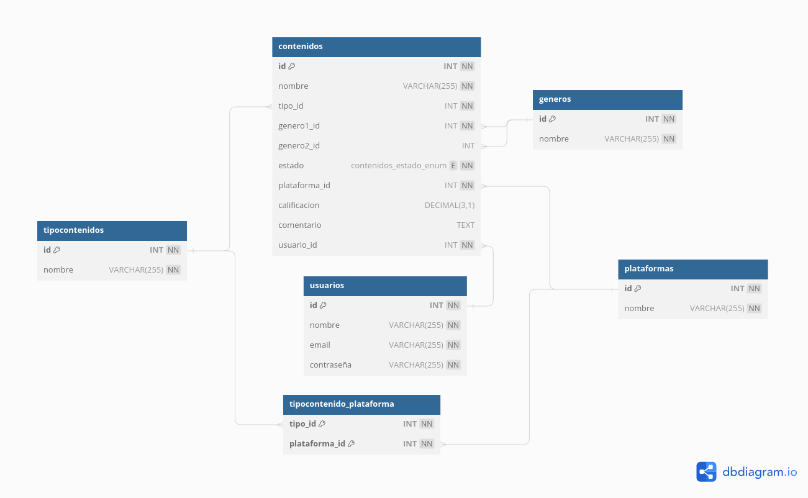

# Gestion de contenidos audiovisuales

Proyecto enfocado en la gestion de contenidos audiovisuales para usuarios registrados en la plataforma. Se integraron validaciones por medio de JWT y aplicacion de varias tecnologias como Java y Spring Boot para el correcto funcionamiento del proyecto.

## Tecnologias

- **JWT**
- **Java**
- **MySQL**
- **Hibernate**
- **Spring Web**
- **Spring Boot**
- **Spring Security**
- **Spring Data JPA**
- **Swagger (OpenApi)**

## Despliegue

> [!NOTE]
> Para usar y ejecutar el proyecto de una mejor manera, realmente recomendamos haber instalado un IDE como IntelliJ.

- Primero, clona el repositorio en tu máquina local.

     ```bash
     git clone https://github.com/jstorra/springboot-filtro.git
     ```

- Abre el proyecto en tu IDE.

> [!IMPORTANT]
> Antes de ejecutar el proyecto debes haber creado la base de datos, ejecuta el siguiente código [DB](./src/main/resources/static/DB.sql) en tu DBMS MySQL.

- Cambie [application.properties](./src/main/resources/application.properties) en caso de que haya modificado sus propiedades de MySQL como host, puerto, nombre de usuario o incluso la contraseña.

- Ahora ejecuta el proyecto, si todo está bien no verás ningún error en la consola de salida.

> [!TIP]
> Disfruta del sistema.

# Base de Datos



# Consumo de API

---
title: OpenAPI definition v0
language_tabs:
  - java: Java
toc_footers: []
includes: []
search: true
highlight_theme: darkula
headingLevel: 2


---

<!-- Generator: Widdershins v4.0.1 -->

<h1 id="openapi-definition">OpenAPI definition v0</h1>

> Scroll down for code samples, example requests and responses. Select a language for code samples from the tabs above or the mobile navigation menu.

Base URLs:

* <a href="http://localhost:8080">http://localhost:8080</a>

# Authentication

- HTTP Authentication, scheme: bearer JWT auth description

<h1 id="openapi-definition-contenido-controller">contenido-controller</h1>

## editarContenido

<a id="opIdeditarContenido"></a>

> Code samples

```java
URL obj = new URL("http://localhost:8080/contenido/{id}");
HttpURLConnection con = (HttpURLConnection) obj.openConnection();
con.setRequestMethod("PUT");
int responseCode = con.getResponseCode();
BufferedReader in = new BufferedReader(
    new InputStreamReader(con.getInputStream()));
String inputLine;
StringBuffer response = new StringBuffer();
while ((inputLine = in.readLine()) != null) {
    response.append(inputLine);
}
in.close();
System.out.println(response.toString());

```

`PUT /contenido/{id}`

> Body parameter

```json
{
  "id": 0,
  "nombre": "string",
  "tipo_id": 0,
  "genero1_id": 0,
  "genero2_id": 0,
  "estado": "string",
  "plataforma_id": 0,
  "calificacion": 0.1,
  "comentario": "string",
  "usuario_id": 0
}
```

<h3 id="editarcontenido-parameters">Parameters</h3>

| Name | In   | Type                                | Required | Description |
| ---- | ---- | ----------------------------------- | -------- | ----------- |
| id   | path | object                              | true     | none        |
| body | body | [ContenidoDTO](#schemacontenidodto) | true     | none        |

> Example responses

> 200 Response

<h3 id="editarcontenido-responses">Responses</h3>

| Status | Meaning                                                      | Description | Schema |
| ------ | ------------------------------------------------------------ | ----------- | ------ |
| 200    | [OK](https://tools.ietf.org/html/rfc7231#section-6.3.1)      | OK          | Inline |
| 400    | [Bad Request](https://tools.ietf.org/html/rfc7231#section-6.5.1) | Bad Request | Inline |
| 404    | [Not Found](https://tools.ietf.org/html/rfc7231#section-6.5.4) | Not Found   | Inline |

<h3 id="editarcontenido-responseschema">Response Schema</h3>

Status Code **200**

| Name                       | Type   | Required | Restrictions | Description |
| -------------------------- | ------ | -------- | ------------ | ----------- |
| » **additionalProperties** | object | false    | none         | none        |

<aside class="warning">
To perform this operation, you must be authenticated by means of one of the following methods:
bearerAuth
</aside>


## eliminarContenido

<a id="opIdeliminarContenido"></a>

> Code samples

```java
URL obj = new URL("http://localhost:8080/contenido/{id}");
HttpURLConnection con = (HttpURLConnection) obj.openConnection();
con.setRequestMethod("DELETE");
int responseCode = con.getResponseCode();
BufferedReader in = new BufferedReader(
    new InputStreamReader(con.getInputStream()));
String inputLine;
StringBuffer response = new StringBuffer();
while ((inputLine = in.readLine()) != null) {
    response.append(inputLine);
}
in.close();
System.out.println(response.toString());

```

`DELETE /contenido/{id}`

<h3 id="eliminarcontenido-parameters">Parameters</h3>

| Name | In   | Type   | Required | Description |
| ---- | ---- | ------ | -------- | ----------- |
| id   | path | object | true     | none        |

> Example responses

> 200 Response

<h3 id="eliminarcontenido-responses">Responses</h3>

| Status | Meaning                                                      | Description | Schema |
| ------ | ------------------------------------------------------------ | ----------- | ------ |
| 200    | [OK](https://tools.ietf.org/html/rfc7231#section-6.3.1)      | OK          | Inline |
| 400    | [Bad Request](https://tools.ietf.org/html/rfc7231#section-6.5.1) | Bad Request | Inline |
| 404    | [Not Found](https://tools.ietf.org/html/rfc7231#section-6.5.4) | Not Found   | Inline |

<h3 id="eliminarcontenido-responseschema">Response Schema</h3>

Status Code **200**

| Name                       | Type   | Required | Restrictions | Description |
| -------------------------- | ------ | -------- | ------------ | ----------- |
| » **additionalProperties** | object | false    | none         | none        |

<aside class="warning">
To perform this operation, you must be authenticated by means of one of the following methods:
bearerAuth
</aside>


## guardarContenido

<a id="opIdguardarContenido"></a>

> Code samples

```java
URL obj = new URL("http://localhost:8080/contenido");
HttpURLConnection con = (HttpURLConnection) obj.openConnection();
con.setRequestMethod("POST");
int responseCode = con.getResponseCode();
BufferedReader in = new BufferedReader(
    new InputStreamReader(con.getInputStream()));
String inputLine;
StringBuffer response = new StringBuffer();
while ((inputLine = in.readLine()) != null) {
    response.append(inputLine);
}
in.close();
System.out.println(response.toString());

```

`POST /contenido`

> Body parameter

```json
{
  "id": 0,
  "nombre": "string",
  "tipo_id": 0,
  "genero1_id": 0,
  "genero2_id": 0,
  "estado": "string",
  "plataforma_id": 0,
  "calificacion": 0.1,
  "comentario": "string",
  "usuario_id": 0
}
```

<h3 id="guardarcontenido-parameters">Parameters</h3>

| Name | In   | Type                                | Required | Description |
| ---- | ---- | ----------------------------------- | -------- | ----------- |
| body | body | [ContenidoDTO](#schemacontenidodto) | true     | none        |

> Example responses

> 200 Response

<h3 id="guardarcontenido-responses">Responses</h3>

| Status | Meaning                                                      | Description | Schema |
| ------ | ------------------------------------------------------------ | ----------- | ------ |
| 200    | [OK](https://tools.ietf.org/html/rfc7231#section-6.3.1)      | OK          | Inline |
| 400    | [Bad Request](https://tools.ietf.org/html/rfc7231#section-6.5.1) | Bad Request | Inline |
| 404    | [Not Found](https://tools.ietf.org/html/rfc7231#section-6.5.4) | Not Found   | Inline |

<h3 id="guardarcontenido-responseschema">Response Schema</h3>

Status Code **200**

| Name                       | Type   | Required | Restrictions | Description |
| -------------------------- | ------ | -------- | ------------ | ----------- |
| » **additionalProperties** | object | false    | none         | none        |

<aside class="warning">
To perform this operation, you must be authenticated by means of one of the following methods:
bearerAuth
</aside>


<h1 id="openapi-definition-usuario-controller">usuario-controller</h1>

## registrar

<a id="opIdregistrar"></a>

> Code samples

```java
URL obj = new URL("http://localhost:8080/usuario/registrar?nombre=string&email=string&contrase%C3%B1a=string");
HttpURLConnection con = (HttpURLConnection) obj.openConnection();
con.setRequestMethod("POST");
int responseCode = con.getResponseCode();
BufferedReader in = new BufferedReader(
    new InputStreamReader(con.getInputStream()));
String inputLine;
StringBuffer response = new StringBuffer();
while ((inputLine = in.readLine()) != null) {
    response.append(inputLine);
}
in.close();
System.out.println(response.toString());

```

`POST /usuario/registrar`

<h3 id="registrar-parameters">Parameters</h3>

| Name       | In    | Type   | Required | Description |
| ---------- | ----- | ------ | -------- | ----------- |
| nombre     | query | string | true     | none        |
| email      | query | string | true     | none        |
| contraseña | query | string | true     | none        |

> Example responses

> 200 Response

<h3 id="registrar-responses">Responses</h3>

| Status | Meaning                                                      | Description | Schema |
| ------ | ------------------------------------------------------------ | ----------- | ------ |
| 200    | [OK](https://tools.ietf.org/html/rfc7231#section-6.3.1)      | OK          | Inline |
| 400    | [Bad Request](https://tools.ietf.org/html/rfc7231#section-6.5.1) | Bad Request | Inline |
| 404    | [Not Found](https://tools.ietf.org/html/rfc7231#section-6.5.4) | Not Found   | Inline |

<h3 id="registrar-responseschema">Response Schema</h3>

Status Code **200**

| Name                       | Type   | Required | Restrictions | Description |
| -------------------------- | ------ | -------- | ------------ | ----------- |
| » **additionalProperties** | object | false    | none         | none        |

<aside class="warning">
To perform this operation, you must be authenticated by means of one of the following methods:
bearerAuth
</aside>


## ingresar

<a id="opIdingresar"></a>

> Code samples

```java
URL obj = new URL("http://localhost:8080/usuario/ingresar?email=string&contrase%C3%B1a=string");
HttpURLConnection con = (HttpURLConnection) obj.openConnection();
con.setRequestMethod("POST");
int responseCode = con.getResponseCode();
BufferedReader in = new BufferedReader(
    new InputStreamReader(con.getInputStream()));
String inputLine;
StringBuffer response = new StringBuffer();
while ((inputLine = in.readLine()) != null) {
    response.append(inputLine);
}
in.close();
System.out.println(response.toString());

```

`POST /usuario/ingresar`

<h3 id="ingresar-parameters">Parameters</h3>

| Name       | In    | Type   | Required | Description |
| ---------- | ----- | ------ | -------- | ----------- |
| email      | query | string | true     | none        |
| contraseña | query | string | true     | none        |

> Example responses

> 200 Response

<h3 id="ingresar-responses">Responses</h3>

| Status | Meaning                                                      | Description | Schema                    |
| ------ | ------------------------------------------------------------ | ----------- | ------------------------- |
| 200    | [OK](https://tools.ietf.org/html/rfc7231#section-6.3.1)      | OK          | [Usuario](#schemausuario) |
| 400    | [Bad Request](https://tools.ietf.org/html/rfc7231#section-6.5.1) | Bad Request | Inline                    |
| 404    | [Not Found](https://tools.ietf.org/html/rfc7231#section-6.5.4) | Not Found   | Inline                    |

<h3 id="ingresar-responseschema">Response Schema</h3>

<aside class="warning">
To perform this operation, you must be authenticated by means of one of the following methods:
bearerAuth
</aside>


## obtenerContenidos

<a id="opIdobtenerContenidos"></a>

> Code samples

```java
URL obj = new URL("http://localhost:8080/usuario/{id}/contenido");
HttpURLConnection con = (HttpURLConnection) obj.openConnection();
con.setRequestMethod("GET");
int responseCode = con.getResponseCode();
BufferedReader in = new BufferedReader(
    new InputStreamReader(con.getInputStream()));
String inputLine;
StringBuffer response = new StringBuffer();
while ((inputLine = in.readLine()) != null) {
    response.append(inputLine);
}
in.close();
System.out.println(response.toString());

```

`GET /usuario/{id}/contenido`

<h3 id="obtenercontenidos-parameters">Parameters</h3>

| Name | In   | Type   | Required | Description |
| ---- | ---- | ------ | -------- | ----------- |
| id   | path | object | true     | none        |

> Example responses

> 200 Response

<h3 id="obtenercontenidos-responses">Responses</h3>

| Status | Meaning                                                      | Description | Schema |
| ------ | ------------------------------------------------------------ | ----------- | ------ |
| 200    | [OK](https://tools.ietf.org/html/rfc7231#section-6.3.1)      | OK          | Inline |
| 400    | [Bad Request](https://tools.ietf.org/html/rfc7231#section-6.5.1) | Bad Request | Inline |
| 404    | [Not Found](https://tools.ietf.org/html/rfc7231#section-6.5.4) | Not Found   | Inline |

<h3 id="obtenercontenidos-responseschema">Response Schema</h3>

Status Code **200**

| Name            | Type                                  | Required | Restrictions | Description |
| --------------- | ------------------------------------- | -------- | ------------ | ----------- |
| *anonymous*     | [[Contenido](#schemacontenido)]       | false    | none         | none        |
| » id            | integer(int32)                        | false    | none         | none        |
| » nombre        | string                                | false    | none         | none        |
| » tipoContenido | [TipoContenido](#schematipocontenido) | false    | none         | none        |
| »» id           | integer(int32)                        | false    | none         | none        |
| »» nombre       | string                                | false    | none         | none        |
| » genero1       | [Genero](#schemagenero)               | false    | none         | none        |
| »» id           | integer(int32)                        | false    | none         | none        |
| »» nombre       | string                                | false    | none         | none        |
| » genero2       | [Genero](#schemagenero)               | false    | none         | none        |
| » estado        | string                                | false    | none         | none        |
| » plataforma    | [Plataforma](#schemaplataforma)       | false    | none         | none        |
| »» id           | integer(int32)                        | false    | none         | none        |
| »» nombre       | string                                | false    | none         | none        |
| » calificacion  | number(double)                        | false    | none         | none        |
| » comentario    | string                                | false    | none         | none        |

<aside class="warning">
To perform this operation, you must be authenticated by means of one of the following methods:
bearerAuth
</aside>


## eliminarUsuario

<a id="opIdeliminarUsuario"></a>

> Code samples

```java
URL obj = new URL("http://localhost:8080/usuario/{id}");
HttpURLConnection con = (HttpURLConnection) obj.openConnection();
con.setRequestMethod("DELETE");
int responseCode = con.getResponseCode();
BufferedReader in = new BufferedReader(
    new InputStreamReader(con.getInputStream()));
String inputLine;
StringBuffer response = new StringBuffer();
while ((inputLine = in.readLine()) != null) {
    response.append(inputLine);
}
in.close();
System.out.println(response.toString());

```

`DELETE /usuario/{id}`

<h3 id="eliminarusuario-parameters">Parameters</h3>

| Name | In   | Type   | Required | Description |
| ---- | ---- | ------ | -------- | ----------- |
| id   | path | object | true     | none        |

> Example responses

> 200 Response

<h3 id="eliminarusuario-responses">Responses</h3>

| Status | Meaning                                                      | Description | Schema |
| ------ | ------------------------------------------------------------ | ----------- | ------ |
| 200    | [OK](https://tools.ietf.org/html/rfc7231#section-6.3.1)      | OK          | Inline |
| 400    | [Bad Request](https://tools.ietf.org/html/rfc7231#section-6.5.1) | Bad Request | Inline |
| 404    | [Not Found](https://tools.ietf.org/html/rfc7231#section-6.5.4) | Not Found   | Inline |

<h3 id="eliminarusuario-responseschema">Response Schema</h3>

Status Code **200**

| Name                       | Type   | Required | Restrictions | Description |
| -------------------------- | ------ | -------- | ------------ | ----------- |
| » **additionalProperties** | object | false    | none         | none        |

<aside class="warning">
To perform this operation, you must be authenticated by means of one of the following methods:
bearerAuth
</aside>


<h1 id="openapi-definition-tipo-contenido-controller">tipo-contenido-controller</h1>

## guardarTipoContenido

<a id="opIdguardarTipoContenido"></a>

> Code samples

```java
URL obj = new URL("http://localhost:8080/tipocontenido");
HttpURLConnection con = (HttpURLConnection) obj.openConnection();
con.setRequestMethod("POST");
int responseCode = con.getResponseCode();
BufferedReader in = new BufferedReader(
    new InputStreamReader(con.getInputStream()));
String inputLine;
StringBuffer response = new StringBuffer();
while ((inputLine = in.readLine()) != null) {
    response.append(inputLine);
}
in.close();
System.out.println(response.toString());

```

`POST /tipocontenido`

> Body parameter

```json
{
  "id": 0,
  "nombre": "string"
}
```

<h3 id="guardartipocontenido-parameters">Parameters</h3>

| Name | In   | Type                                  | Required | Description |
| ---- | ---- | ------------------------------------- | -------- | ----------- |
| body | body | [TipoContenido](#schematipocontenido) | true     | none        |

> Example responses

> 200 Response

<h3 id="guardartipocontenido-responses">Responses</h3>

| Status | Meaning                                                      | Description | Schema |
| ------ | ------------------------------------------------------------ | ----------- | ------ |
| 200    | [OK](https://tools.ietf.org/html/rfc7231#section-6.3.1)      | OK          | Inline |
| 400    | [Bad Request](https://tools.ietf.org/html/rfc7231#section-6.5.1) | Bad Request | Inline |
| 404    | [Not Found](https://tools.ietf.org/html/rfc7231#section-6.5.4) | Not Found   | Inline |

<h3 id="guardartipocontenido-responseschema">Response Schema</h3>

Status Code **200**

| Name                       | Type   | Required | Restrictions | Description |
| -------------------------- | ------ | -------- | ------------ | ----------- |
| » **additionalProperties** | object | false    | none         | none        |

<aside class="warning">
To perform this operation, you must be authenticated by means of one of the following methods:
bearerAuth
</aside>


## agregarPlataforma

<a id="opIdagregarPlataforma"></a>

> Code samples

```java
URL obj = new URL("http://localhost:8080/tipocontenido/agregarPlataforma");
HttpURLConnection con = (HttpURLConnection) obj.openConnection();
con.setRequestMethod("POST");
int responseCode = con.getResponseCode();
BufferedReader in = new BufferedReader(
    new InputStreamReader(con.getInputStream()));
String inputLine;
StringBuffer response = new StringBuffer();
while ((inputLine = in.readLine()) != null) {
    response.append(inputLine);
}
in.close();
System.out.println(response.toString());

```

`POST /tipocontenido/agregarPlataforma`

> Body parameter

```json
{
  "property1": {},
  "property2": {}
}
```

<h3 id="agregarplataforma-parameters">Parameters</h3>

| Name                       | In   | Type   | Required | Description |
| -------------------------- | ---- | ------ | -------- | ----------- |
| body                       | body | object | true     | none        |
| » **additionalProperties** | body | object | false    | none        |

> Example responses

> 200 Response

<h3 id="agregarplataforma-responses">Responses</h3>

| Status | Meaning                                                      | Description | Schema |
| ------ | ------------------------------------------------------------ | ----------- | ------ |
| 200    | [OK](https://tools.ietf.org/html/rfc7231#section-6.3.1)      | OK          | Inline |
| 400    | [Bad Request](https://tools.ietf.org/html/rfc7231#section-6.5.1) | Bad Request | Inline |
| 404    | [Not Found](https://tools.ietf.org/html/rfc7231#section-6.5.4) | Not Found   | Inline |

<h3 id="agregarplataforma-responseschema">Response Schema</h3>

Status Code **200**

| Name                       | Type   | Required | Restrictions | Description |
| -------------------------- | ------ | -------- | ------------ | ----------- |
| » **additionalProperties** | object | false    | none         | none        |

<aside class="warning">
To perform this operation, you must be authenticated by means of one of the following methods:
bearerAuth
</aside>


<h1 id="openapi-definition-plataforma-controller">plataforma-controller</h1>

## guardarPlataforma

<a id="opIdguardarPlataforma"></a>

> Code samples

```java
URL obj = new URL("http://localhost:8080/plataforma");
HttpURLConnection con = (HttpURLConnection) obj.openConnection();
con.setRequestMethod("POST");
int responseCode = con.getResponseCode();
BufferedReader in = new BufferedReader(
    new InputStreamReader(con.getInputStream()));
String inputLine;
StringBuffer response = new StringBuffer();
while ((inputLine = in.readLine()) != null) {
    response.append(inputLine);
}
in.close();
System.out.println(response.toString());

```

`POST /plataforma`

> Body parameter

```json
{
  "id": 0,
  "nombre": "string"
}
```

<h3 id="guardarplataforma-parameters">Parameters</h3>

| Name | In   | Type                            | Required | Description |
| ---- | ---- | ------------------------------- | -------- | ----------- |
| body | body | [Plataforma](#schemaplataforma) | true     | none        |

> Example responses

> 200 Response

<h3 id="guardarplataforma-responses">Responses</h3>

| Status | Meaning                                                      | Description | Schema |
| ------ | ------------------------------------------------------------ | ----------- | ------ |
| 200    | [OK](https://tools.ietf.org/html/rfc7231#section-6.3.1)      | OK          | Inline |
| 400    | [Bad Request](https://tools.ietf.org/html/rfc7231#section-6.5.1) | Bad Request | Inline |
| 404    | [Not Found](https://tools.ietf.org/html/rfc7231#section-6.5.4) | Not Found   | Inline |

<h3 id="guardarplataforma-responseschema">Response Schema</h3>

Status Code **200**

| Name                       | Type   | Required | Restrictions | Description |
| -------------------------- | ------ | -------- | ------------ | ----------- |
| » **additionalProperties** | object | false    | none         | none        |

<aside class="warning">
To perform this operation, you must be authenticated by means of one of the following methods:
bearerAuth
</aside>


## agregarTipoContenido

<a id="opIdagregarTipoContenido"></a>

> Code samples

```java
URL obj = new URL("http://localhost:8080/plataforma/agregarContenido");
HttpURLConnection con = (HttpURLConnection) obj.openConnection();
con.setRequestMethod("POST");
int responseCode = con.getResponseCode();
BufferedReader in = new BufferedReader(
    new InputStreamReader(con.getInputStream()));
String inputLine;
StringBuffer response = new StringBuffer();
while ((inputLine = in.readLine()) != null) {
    response.append(inputLine);
}
in.close();
System.out.println(response.toString());

```

`POST /plataforma/agregarContenido`

> Body parameter

```json
{
  "property1": {},
  "property2": {}
}
```

<h3 id="agregartipocontenido-parameters">Parameters</h3>

| Name                       | In   | Type   | Required | Description |
| -------------------------- | ---- | ------ | -------- | ----------- |
| body                       | body | object | true     | none        |
| » **additionalProperties** | body | object | false    | none        |

> Example responses

> 200 Response

<h3 id="agregartipocontenido-responses">Responses</h3>

| Status | Meaning                                                      | Description | Schema |
| ------ | ------------------------------------------------------------ | ----------- | ------ |
| 200    | [OK](https://tools.ietf.org/html/rfc7231#section-6.3.1)      | OK          | Inline |
| 400    | [Bad Request](https://tools.ietf.org/html/rfc7231#section-6.5.1) | Bad Request | Inline |
| 404    | [Not Found](https://tools.ietf.org/html/rfc7231#section-6.5.4) | Not Found   | Inline |

<h3 id="agregartipocontenido-responseschema">Response Schema</h3>

Status Code **200**

| Name                       | Type   | Required | Restrictions | Description |
| -------------------------- | ------ | -------- | ------------ | ----------- |
| » **additionalProperties** | object | false    | none         | none        |

<aside class="warning">
To perform this operation, you must be authenticated by means of one of the following methods:
bearerAuth
</aside>


<h1 id="openapi-definition-genero-controller">genero-controller</h1>

## guardarGenero

<a id="opIdguardarGenero"></a>

> Code samples

```java
URL obj = new URL("http://localhost:8080/genero");
HttpURLConnection con = (HttpURLConnection) obj.openConnection();
con.setRequestMethod("POST");
int responseCode = con.getResponseCode();
BufferedReader in = new BufferedReader(
    new InputStreamReader(con.getInputStream()));
String inputLine;
StringBuffer response = new StringBuffer();
while ((inputLine = in.readLine()) != null) {
    response.append(inputLine);
}
in.close();
System.out.println(response.toString());

```

`POST /genero`

> Body parameter

```json
{
  "id": 0,
  "nombre": "string"
}
```

<h3 id="guardargenero-parameters">Parameters</h3>

| Name | In   | Type                    | Required | Description |
| ---- | ---- | ----------------------- | -------- | ----------- |
| body | body | [Genero](#schemagenero) | true     | none        |

> Example responses

> 200 Response

<h3 id="guardargenero-responses">Responses</h3>

| Status | Meaning                                                      | Description | Schema |
| ------ | ------------------------------------------------------------ | ----------- | ------ |
| 200    | [OK](https://tools.ietf.org/html/rfc7231#section-6.3.1)      | OK          | Inline |
| 400    | [Bad Request](https://tools.ietf.org/html/rfc7231#section-6.5.1) | Bad Request | Inline |
| 404    | [Not Found](https://tools.ietf.org/html/rfc7231#section-6.5.4) | Not Found   | Inline |

<h3 id="guardargenero-responseschema">Response Schema</h3>

Status Code **200**

| Name                       | Type   | Required | Restrictions | Description |
| -------------------------- | ------ | -------- | ------------ | ----------- |
| » **additionalProperties** | object | false    | none         | none        |

<aside class="warning">
To perform this operation, you must be authenticated by means of one of the following methods:
bearerAuth
</aside>


# Schemas

<h2 id="tocS_ContenidoDTO">ContenidoDTO</h2>

<!-- backwards compatibility -->
<a id="schemacontenidodto"></a>
<a id="schema_ContenidoDTO"></a>
<a id="tocScontenidodto"></a>
<a id="tocscontenidodto"></a>

```json
{
  "id": 0,
  "nombre": "string",
  "tipo_id": 0,
  "genero1_id": 0,
  "genero2_id": 0,
  "estado": "string",
  "plataforma_id": 0,
  "calificacion": 0.1,
  "comentario": "string",
  "usuario_id": 0
}

```

### Properties

| Name          | Type           | Required | Restrictions | Description |
| ------------- | -------------- | -------- | ------------ | ----------- |
| id            | integer(int32) | false    | none         | none        |
| nombre        | string         | false    | none         | none        |
| tipo_id       | integer(int32) | false    | none         | none        |
| genero1_id    | integer(int32) | false    | none         | none        |
| genero2_id    | integer(int32) | false    | none         | none        |
| estado        | string         | false    | none         | none        |
| plataforma_id | integer(int32) | false    | none         | none        |
| calificacion  | number(double) | false    | none         | none        |
| comentario    | string         | false    | none         | none        |
| usuario_id    | integer(int32) | false    | none         | none        |

<h2 id="tocS_Contenido">Contenido</h2>

<!-- backwards compatibility -->
<a id="schemacontenido"></a>
<a id="schema_Contenido"></a>
<a id="tocScontenido"></a>
<a id="tocscontenido"></a>

```json
{
  "id": 0,
  "nombre": "string",
  "tipoContenido": {
    "id": 0,
    "nombre": "string"
  },
  "genero1": {
    "id": 0,
    "nombre": "string"
  },
  "genero2": {
    "id": 0,
    "nombre": "string"
  },
  "estado": "string",
  "plataforma": {
    "id": 0,
    "nombre": "string"
  },
  "calificacion": 0.1,
  "comentario": "string"
}

```

### Properties

| Name          | Type                                  | Required | Restrictions | Description |
| ------------- | ------------------------------------- | -------- | ------------ | ----------- |
| id            | integer(int32)                        | false    | none         | none        |
| nombre        | string                                | false    | none         | none        |
| tipoContenido | [TipoContenido](#schematipocontenido) | false    | none         | none        |
| genero1       | [Genero](#schemagenero)               | false    | none         | none        |
| genero2       | [Genero](#schemagenero)               | false    | none         | none        |
| estado        | string                                | false    | none         | none        |
| plataforma    | [Plataforma](#schemaplataforma)       | false    | none         | none        |
| calificacion  | number(double)                        | false    | none         | none        |
| comentario    | string                                | false    | none         | none        |

<h2 id="tocS_Genero">Genero</h2>

<!-- backwards compatibility -->
<a id="schemagenero"></a>
<a id="schema_Genero"></a>
<a id="tocSgenero"></a>
<a id="tocsgenero"></a>

```json
{
  "id": 0,
  "nombre": "string"
}

```

### Properties

| Name   | Type           | Required | Restrictions | Description |
| ------ | -------------- | -------- | ------------ | ----------- |
| id     | integer(int32) | false    | none         | none        |
| nombre | string         | false    | none         | none        |

<h2 id="tocS_Plataforma">Plataforma</h2>

<!-- backwards compatibility -->
<a id="schemaplataforma"></a>
<a id="schema_Plataforma"></a>
<a id="tocSplataforma"></a>
<a id="tocsplataforma"></a>

```json
{
  "id": 0,
  "nombre": "string"
}

```

### Properties

| Name   | Type           | Required | Restrictions | Description |
| ------ | -------------- | -------- | ------------ | ----------- |
| id     | integer(int32) | false    | none         | none        |
| nombre | string         | false    | none         | none        |

<h2 id="tocS_TipoContenido">TipoContenido</h2>

<!-- backwards compatibility -->
<a id="schematipocontenido"></a>
<a id="schema_TipoContenido"></a>
<a id="tocStipocontenido"></a>
<a id="tocstipocontenido"></a>

```json
{
  "id": 0,
  "nombre": "string"
}

```

### Properties

| Name   | Type           | Required | Restrictions | Description |
| ------ | -------------- | -------- | ------------ | ----------- |
| id     | integer(int32) | false    | none         | none        |
| nombre | string         | false    | none         | none        |

<h2 id="tocS_Usuario">Usuario</h2>

<!-- backwards compatibility -->
<a id="schemausuario"></a>
<a id="schema_Usuario"></a>
<a id="tocSusuario"></a>
<a id="tocsusuario"></a>

```json
{
  "token": "string",
  "contenidos": [
    {
      "id": 0,
      "nombre": "string",
      "tipoContenido": {
        "id": 0,
        "nombre": "string"
      },
      "genero1": {
        "id": 0,
        "nombre": "string"
      },
      "genero2": {
        "id": 0,
        "nombre": "string"
      },
      "estado": "string",
      "plataforma": {
        "id": 0,
        "nombre": "string"
      },
      "calificacion": 0.1,
      "comentario": "string"
    }
  ]
}

```

### Properties

| Name       | Type                            | Required | Restrictions | Description |
| ---------- | ------------------------------- | -------- | ------------ | ----------- |
| token      | string                          | false    | none         | none        |
| contenidos | [[Contenido](#schemacontenido)] | false    | none         | none        |

---

<p align="center">Developed by <a href="https://github.com/jstorra">@jstorra</a></p>